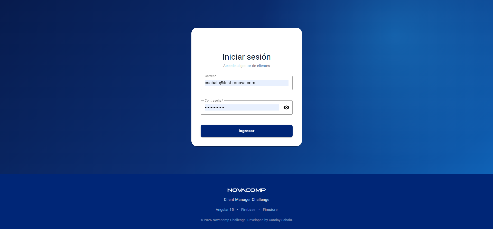
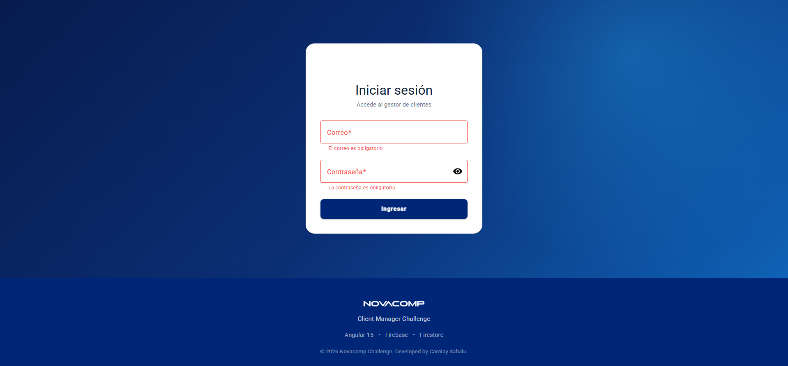
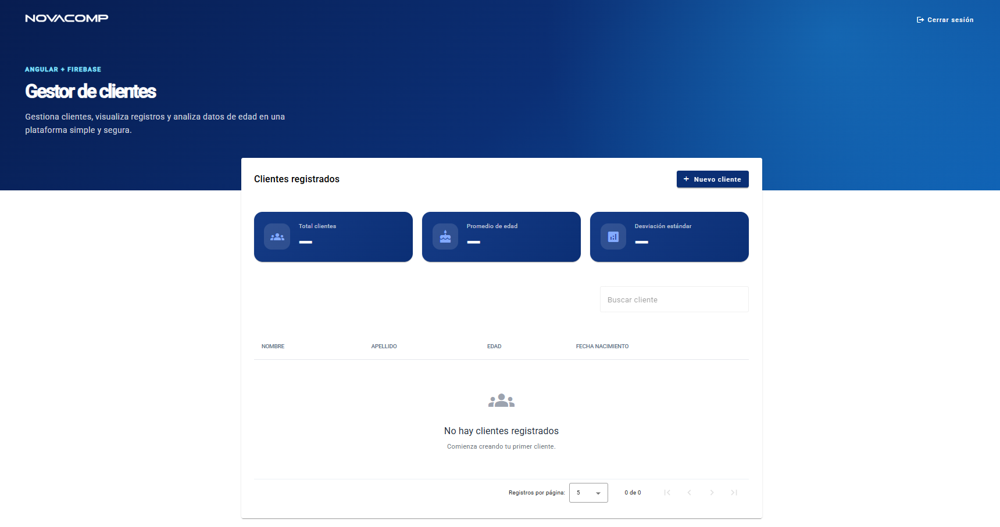
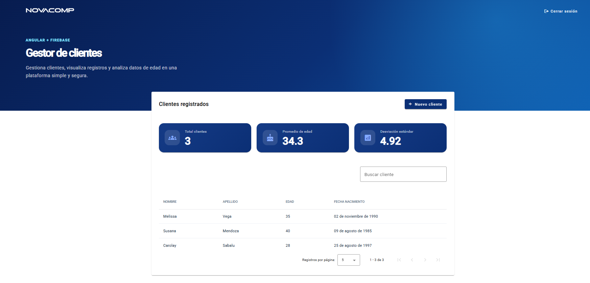
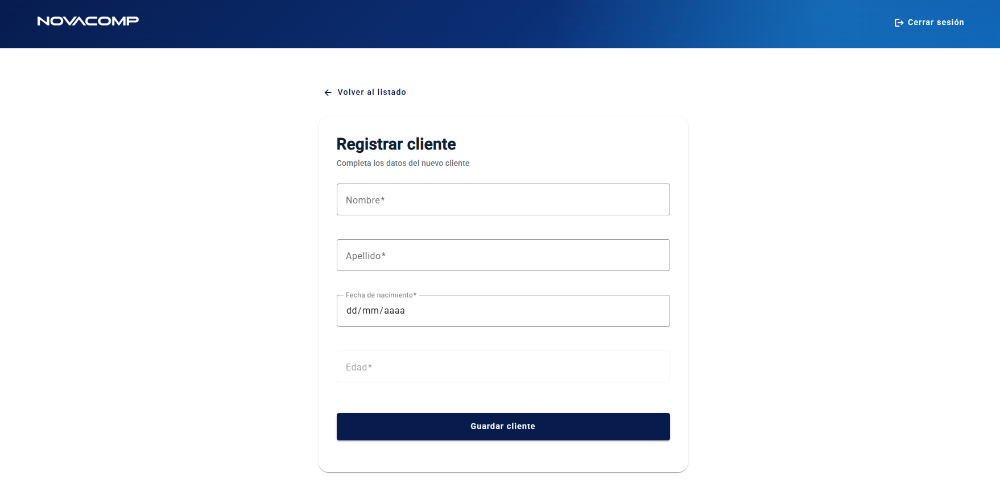
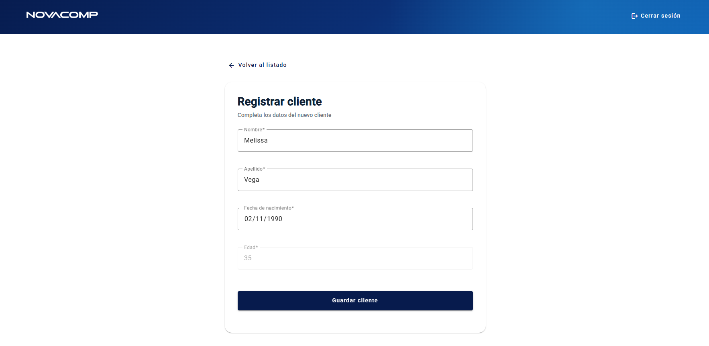
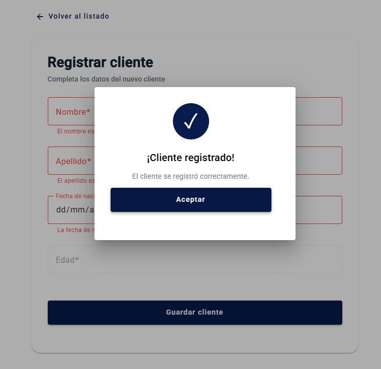
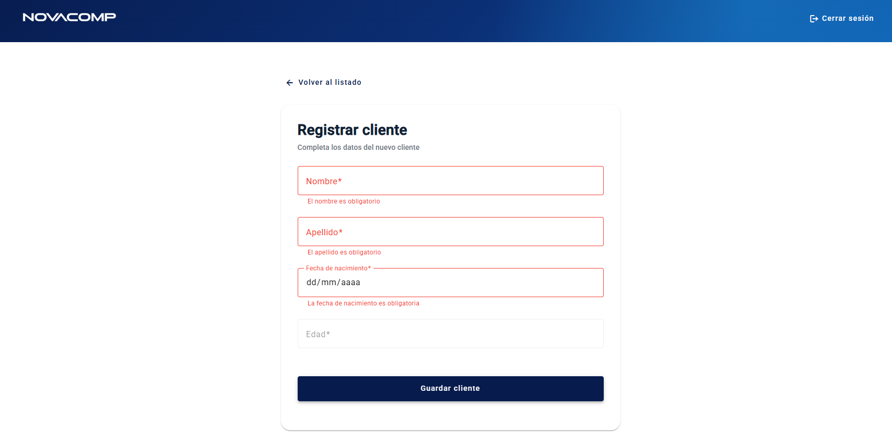

# Novacomp Client Manager Challenge

Aplicación web desarrollada con **Angular 15** y **Firebase** para la gestión de clientes. Permite autenticación de usuarios, registro de clientes, consulta de información y visualización de estadísticas básicas sobre los datos registrados.

---

## 🚀 Demo

**Live Demo:** https://novacomp-client-manager.web.app

### Credenciales

```text
Correo:      csabalu@test.crnova.com
Contraseña:  Novacomp2026!
```
---

## 💻 Tecnologías utilizadas

- Angular 15
- TypeScript
- Angular Material
- Firebase Authentication
- Cloud Firestore
- RxJS
- SCSS

---

## Funcionalidades

### Autenticación

- Inicio de sesión mediante Firebase Authentication.
- Protección de rutas mediante AuthGuard.
- Cierre de sesión.

### Gestión de clientes

- Registro de clientes.
- Listado de clientes.
- Búsqueda por nombre, apellido o edad.
- Ordenamiento por columnas.
- Paginación.
- Fecha de nacimiento formateada mediante Pipe personalizado.
- Cálculo automático de la edad a partir de la fecha de nacimiento.
- Validaciones de formulario.

### Estadísticas

- Total de clientes registrados.
- Promedio de edad.
- Desviación estándar de las edades.

### Experiencia de usuario

- Loading global durante operaciones.
- Modal de confirmación al registrar un cliente.
- Estado vacío cuando no existen registros.
- Interfaz responsive.

---

## 📁 Arquitectura del proyecto

El proyecto sigue una estructura modular basada en características (feature-based architecture), separando la lógica de negocio, componentes compartidos y funcionalidades principales.

```text
src
├── app
│   ├── core
│   │   ├── guards
│   │   ├── models
│   │   ├── services
│   │   └── validators
│   │
│   ├── features
│   │   ├── auth
│   │   └── clients
│   │
│   ├── shared
│   │   ├── components
│   │   └── pipes
│   │
│   ├── app-routing.module.ts
│   ├── app.component.*
│   └── app.module.ts
│
├── assets
├── environments
├── styles.scss
└── main.ts
```

### Organización

- **Core:** Servicios globales, modelos, guards y validadores reutilizables.
- **Features:** Módulos funcionales de la aplicación (Autenticación y Gestión de Clientes).
- **Shared:** Componentes y pipes reutilizables en toda la aplicación.
- **Assets:** Recursos estáticos como imágenes.
- **Environments:** Configuración de Firebase según el entorno.

## ⚙️ Instalación

### Clonar el repositorio

```bash
git clone https://github.com/nikollsabalu/novacomp-client-manager-challenge.git
```

### Instalar dependencias

```bash
npm install
```

### Ejecutar el proyecto

```bash
ng serve
```

La aplicación estará disponible en:

```
http://localhost:4200
```

## 🔥 Firebase

El proyecto utiliza los siguientes servicios de Firebase:

- Authentication
- Cloud Firestore

Es necesario configurar el archivo:

```
src/environments/environment.ts
```

con las credenciales correspondientes del proyecto Firebase.

---

  
## 🔎 Vista previa de la aplicación
### Login



_Validaciones_

 

### Listado de clientes

_Listado sin registros_
 


_Listado con registros_


 

### Registro de cliente
 




_Validaciones_




---

## 🌐 Deploy

Aplicación desplegada en Firebase Hosting:

```
https://novacomp-client-manager.web.app
```

---

## 👩‍💻Desarrollado por

**Ing. Carolay N. Sabalu Ordinola**

Frontend Developer (Angular & React)

GitHub: https://github.com/nikollsabalu

LinkedIn: https://www.linkedin.com/in/nikollsabalu/